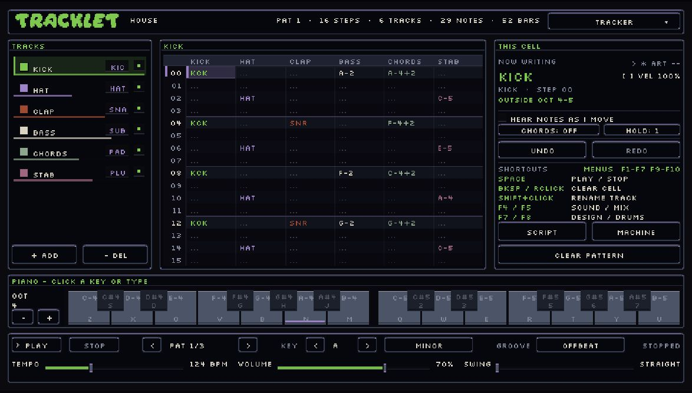

<p align="center">
  
</p>
<p align="center">
  <strong>A friendly music tracker.</strong><br>
  <a href="https://caleb.website/tracklet">Webpage</a> ·
  <a href="https://caleb.website/tracklet/try">Open Tracklet</a> ·
  <a href="doc/01-getting-started.md">Getting started</a> ·
  <a href="doc/03-script-reference.md">Script reference</a>
</p>



Write a melody on the piano, build a beat, and arrange it into a song. Tracklet runs in your browser: the synths, sequencer, mixer, recorder, and exports all work locally. No account is needed.

This is the beta. Save songs you want to keep; browser storage is useful for picking up where you left off, but it is not a backup.

## Seven pages, one song

| Page | What it does |
| --- | --- |
| **Tracker** | Edit notes in a pattern grid or piano roll. Play the on-screen piano, type notes, or use a MIDI controller where supported. Set the key and scale, write chords, adjust velocity and holds, and rename tracks and songs. |
| **Drum Machine** | Program a step sequencer with drum voices, kits, accents, and per-pad controls. Use synthesized drums or imported samples alongside the melodic tracks. |
| **Mixer** | Set channel level, pan, mute, solo, sends, effects, and routing. Mix through groups and a master bus; compare A/B balances and copy channel settings. |
| **Arranger** | Lay patterns out as bars, name sections, and shape a selected channel with automation lanes. |
| **Arp** | Turn a chord into a run. Choose direction, octaves, steps per note, intensity, and chord or song source; preview the notes before writing them to a pattern. |
| **Live** | Build scenes with one pattern per channel. Launch them immediately or on a quantized boundary, audition clips, and switch between editing and performing. |
| **Recorder** | Record a microphone or import audio. Inspect the waveform, trim takes, set loops, assign audio to a channel, and export the song. |

## Sounds and songwriting

- **Synth voices:** leads, basses, pads, strings, bells, plucks, organs, flutes, noise, and drums, with envelopes, layers, waveforms, modulation, and effects to shape them.
- **Imported instruments:** samples, SoundFont banks, saved patches and drum kits, and Noislet instrument files. Keep reusable sounds and kits in your browser library.
- **Musical controls:** key and scale guides, tempo, swing and grooves, tuning, chords, progressions, strums, arpeggios, and pattern variations.
- **Starters:** house, lo-fi, ballad, rock, emo, vaporwave, synthwave, shoegaze, and drum and bass song templates.
- **Editing:** undo, redo, a browsable history, track and pattern operations, keyboard shortcuts, mouse controls, gamepad navigation, themes, and text-size settings.
- **Scripts:** write or paste Tracklet Script to create and edit music. The editor reports line errors and provides examples and a command reference. Script editing is part of the app; the excluded `scripts/` folder is only a collection of external examples and generators.

## Files and exports

Open Tracklet Script (`.txt`), song JSON (`.json`), and MIDI (`.mid`) files. Save songs as scripts or JSON; save individual sounds and kits separately.

Export the mix as **WAV**, separate channels as a **stems ZIP**, or notes as **MIDI**. Audio exports support whole-song or bar-range selection and loudness targets. MIDI carries notes rather than Tracklet's synth sound. Recorded/imported audio lives in the session's sample bank; keep the original audio files as well as your song.

## Quick controls

| Control | Action |
| --- | --- |
| On-screen piano / `Z X C…` and `Q 2 W…` | Write notes |
| Arrow keys | Move around the pattern |
| `Space` / `Esc` | Play / stop |
| `Backspace`, `Delete`, or right-click a cell | Clear a cell |
| `Ctrl+Z` / `Ctrl+Shift+Z` | Undo / redo |
| `Page Up` / `Page Down` | Previous / next pattern |
| Shift-click a track name or song title | Rename it |
| `F1` | Controls and help |
| `F2` / `F3` / `F4` | Files / song order / sounds |
| `F5` / `F6` | Mixer / instrument browser |
| `F9` / `F10` | Appearance / history |

Use the header menu to switch pages. Each page shows its own shortcuts.

## Run locally

Use a current Node.js LTS release and npm.

```sh
npm ci
npm run dev
```

Open the address printed by Vite (normally `http://localhost:5200`). This repository includes the required `phaser-ui-canvas` source in `vendor/`; no other Doodadarium applications are needed.

| Command | Purpose |
| --- | --- |
| `npm run dev` | Start the development server |
| `npm run build` | Typecheck and build the website into `dist/` |
| `npm run preview` | Preview the production build locally |
| `npm run typecheck` | Check TypeScript |
| `npm test` | Run the model and API tests |
| `npm run api` | Run a Core API operation from the command line |
| `npm run api:server` | Start the local HTTP API and MCP endpoint |
| `npm run mcp` | Start the MCP server over standard input/output |

## Host it on your website

```sh
npm ci
npm run build
```

Copy **the contents of `dist/`** into your website's `tracklet/` directory, then serve it at `https://caleb.website/tracklet/`. The build uses relative asset paths so it can live in a subdirectory. Configure the host to serve the directory's `index.html`; use HTTPS for microphone access and other browser permissions.

You do not need to upload the source, `node_modules`, API server, documentation, scripts, or storage. The build includes the app and its public assets. `npm run preview` is a local check, not a production server.

### Browser limits

Audio starts after a user gesture. Microphone recording needs permission and HTTPS (or localhost). MIDI input and audio import support depend on the browser and device. The interface is designed around a keyboard and mouse; small touch screens have less room for the grid.

Songs and preferences stay in that browser unless you save/export them. There is no account sync or shared cloud library. Soundfonts and personal music under `storage/` are not shipped; import your own files, or host assets you have permission to distribute. The development storage endpoint is not part of the static build.

### MCP and AI clients

The included MCP server is a **separate Node.js process**, available over stdio or at `http://127.0.0.1:4590/mcp`:

```sh
npm run api:server
```

It exposes the same operations as the Core API: inspect the language and instruments, generate and edit song data, and read/write a local song library. It does **not** see the song open in the browser, capture a visitor's microphone, or play audio in their tab. Bring its output into the app as a script or song file.

Static hosting does not run this server. A public MCP service would need a backend with authentication, isolated user workspaces, request limits, and HTTPS. Controlling a visitor's current song would also need an explicit connection between that backend and the browser session. The included local server trusts whoever can reach it; do not expose it unchanged as a shared public endpoint.

See the [API guide](API/README.md) for the operations, transport details, and client configuration.

## What stays out of Git

`script/`, `scripts/`, `storage/`, dependencies, builds, local agent settings, scratch files, and roadmap notes are ignored. Tests tied to the excluded personal music collections are excluded from the public repository too. The user guides, script reference, API documentation, source tests, and required UI framework remain.

**`.gitignore` only controls Git.** It does not stop Explorer, FTP, an upload tool, or a deployment process from copying files. A copied `.gitignore` applies to untracked files under that directory in another Git repository; it does not untrack files already committed there. Deploying only `dist/` avoids uploading the development folders in the first place.

## Documentation

- [Getting started](doc/01-getting-started.md)
- [Music primer](doc/02-music-primer.md)
- [Script reference](doc/03-script-reference.md)
- [Cookbook](doc/04-cookbook.md) and [examples](doc/06-examples.md)
- [Song files](doc/09-song-files.md) and [instruments](doc/10-instruments.md)
- [Agent guide](doc/07-agent-guide.md) and [API guide](API/README.md)

Built with [Phaser](https://phaser.io/) and the bundled phaser-ui-canvas framework. Third-party fonts retain their own terms: Silkscreen, Alagard, Daydream, and Maze. The bundled Daydream demo and Maze fonts are identified in the app as personal-use fonts; check the authors' licenses before commercial use or further redistribution.
